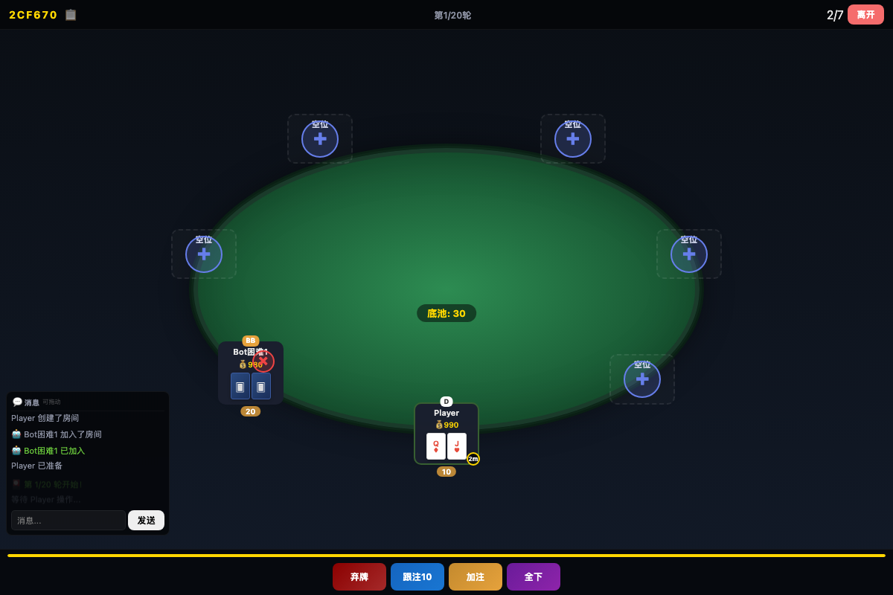

# Texas Hold’em · 德州扑克

[English](README.md)

## 这是什么

一个在浏览器里玩的多人德州扑克游戏。创建房间，把房间号发给朋友，也可以添加机器人练习。每桌最多七人，仅使用虚拟筹码，不包含真实资金支付。

**当前为可运行的原型。** 已有房间、下注、牌型判断、聊天和机器人；完整多人体验、规则边界和生产可靠性尚未全面验证。



*截图来自本地开发环境，使用虚构玩家，不代表线上服务已验收。*

## 怎么使用

需要 Node.js 18+ 和 npm。

```sh
git clone https://github.com/wangyuqin378-cpu/texas-holdem.git
cd texas-holdem
npm install
npm start
```

1. 打开 [localhost:3000](http://localhost:3000)，输入昵称，点击「创建房间」。
2. 分享房间号。另一位玩家用第二个浏览器会话连接同一服务器并加入，也可以点击空座位上的 **+** 添加机器人。
3. 玩家准备后，根据轮次使用弃牌、过牌、跟注、加注等操作。

同一局域网的朋友可以通过你的电脑局域网地址和 3000 端口访问。服务默认监听全部网络接口；端口占用时，运行 `PORT=3001 npm start`，并改为访问对应端口。

初始筹码、盲注等见[游戏规则与说明](docs/GAME.zh-CN.md#游戏规则)。房间能够启动，不等于所有牌局规则都已验证。

## 为什么做

浏览器房间让朋友之间可以直接开始一局，不必安装客户端。德州扑克也是一个具体的实时网页实验：多人要看到一致的牌桌，按顺序行动，并随游戏进程同步状态。

这个项目把这些环节做成可运行的原型，再加入机器人，让没有凑齐朋友时也能体验基本流程。

**许可：** 源码公开可见，尚未授予开源许可证。
